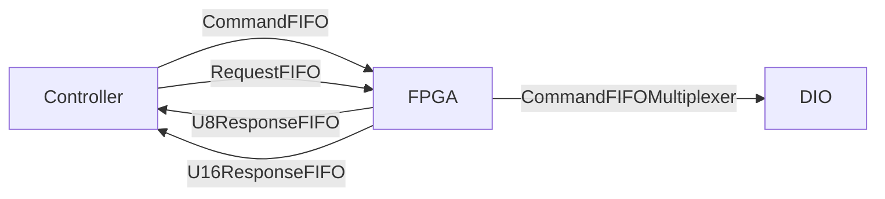

# ts_M1M3SupportFPGA

## Description

This repository contains the LabVIEW 2018 FPGA design for the M1M3 Support
System FPGA used by the **ts_M1M3Support** software. The FPGA is middleman
between [C/C++ control application](https://github.com/lsst-ts/ts_m1m3Support)
and hardware connected to cRIO.

*Please use git clone --recursive to get linked dependencies (Common_ libraries).*

## LabView Dependencies

* FPGA Support
* cRIO support
* Real Time support
* [NI Tools Network](https://www.ni.com/labview-tools-network)
  * LabView FPGA Floating-Point Library by NI

If all is installed and setup properly, LabView splash screen will show chip
and clock icons - see [an
example](https://www.evergreeninnovations.co/blog-labview-rt-project/).

*Please use git clone --recursive to get linked dependencies (Common_ libraries).*

## LabView Dependencies

* FPGA Support
* cRIO support
* Real Time support
* [NI Tools Network](https://www.ni.com/labview-tools-network)
  * LabView FPGA Floating-Point Library by NI

If all is installed and setup properly, LabView splash screen will show chip
and clock icons - see [an
example](https://www.evergreeninnovations.co/blog-labview-rt-project/).

## Build Instructions

Building the FPGA takes just about an hour. As [C++
Controller](https://github.com/lsst-ts/ts_m1m3support) is used to talk to FPGA,
you need to generate C API and transfer the bitfile to cRIO, and C header and
source files to src/LSST/M1M3/SS/FPGA directory. Bitfile is loaded by
NiFpga_Open call, and contains binary data send to program the FPGA.

It is pretty common for the FPGA build process to get stuck on the *Generate
Xilinx IP* step. To get around this issue rebuilding an empty VI seems to fix
the issue. If the *Generate Xilinx IP* step takes longer than 30 minutes it
probably isn't going to complete so abort the compilation and repeat starting
at step 6.

1. Open LabVIEW 2018.
2. Open M1M3SupportFPGA.lvproj
3. Expand RT CompactRIO Target
4. Expand FPGA Target
5. Expand Build Specifications
6. Select M1M3SupportFPGA
7. Right-Click -> Build
8. Select "Use the local compile server" _(it's usually faster than LabView FPGA Compile Cloud)_
9. Click OK
10. Wait for build to successfully finish
11. Select M1M3SupportFPGA.vi (under FPGA Target)
12. Right click, select **"Launch C API Generator"**
13. Click **Generate** (after selecting existing output directory and leaving Prefix blank)
14. Copy resulting lvbitx file to ts_m1m3Support/Bitfiles, and NiFpga_M1M3SupportFPGA.h to ts_m1m3Support/src/LSST/M1M3/SS/FPGA
15. Recompile ts_M1M3Support

## Overview

The FPGA design makes heavy use of FIFOs and **S**ingle **C**ycle **T**imed
**L**oop (**SCTL**) for critical hardware loops. As FPGA has to sample DIOs
(serial lines, accelerometers,.. ), it's critical those are properly timed and
running all the time. In a classic front/back processing design (see e.g. Linux
Kernel interrupt handling), sampling code just record the values or bits and
bytes and ship them to a FIFO queues for handling. SCTLs, which are guarantee
to take one clock tick, are ideal for handling inputs and outputs.

Receiving (reading) code works by placing values into FIFO. Transmitting
(writing) code works by reading (without timeout) from FIFO, and if something
is available, act accordingly. This is coupled with DIO states (e.g. to make
sure next bit/byte on serial line is transmitted after the current).

## Command multiplexing

Commands, followed by arguments are filled into _Software
Resources/CommandFIFO_. _Commands/CommandFIFOMultiplexer_ read this and
multiplex the command to various handlers _(This is exactly how CPUs are
handling instructions from binary code)_. Handlers fills in queues (e.g. ModBus
write queue with instructions to write if you are writing to a queue).
**SCTL**s are handling low level IO. 

## Request multiplexing

Data cannot be read by controller directly (via DMA), but has to be passed
through FIFOs _(usually FPGAs allows DMA to read data directly from memory, but
that doesn't seem to be cause with cRIO design)_. So Controller have to issue
request by writing it to _Software Resources/RequestFIFO_. Responses are read
from _Software Resources/SGLResponseFIFO_, _Software Resources/U8ResponseFIFO_
and _Software Resources/U16ResponseFIFO_.

## Telemetry, Health and Status

Telemetry or Health and Status data are recorded in **STCL**. Telemetry request
(253, _Data Types/Addresses_) dumps 323 U8 values from
_Telemetry/Hardware/Memory_ into _Software Resources/U8ResponseFIFO_. _Memory_
is filled from various FIFOs, which are filled from DIOs - see _Telemetry_.

## Health and Status

Similar to telemetry, request 254 copies data from _Software Resources/Health
and Status/HealthAndStatusMemory_ into _Software Resources/U16ReponseFIFO_. One
U64 is stored in four U16 FIFO elements _(TODO: it's unknow why there isn't
U64ResponseFIFO)_. Number of data to be copied is argument written to _Software
Resources/RequestFIFO_.

### Health and Status Memory

See [HealthAndStatusMemory.md](HealthAndStatusMemory.md) for memory content.

## Digital Input

**DigitalInput** is very simple process that takes the digital input signals
and samples them every 0.200 ms (5kHz). The trigger for the process can be
found under *DigitalInput/Support/DigitalInputTrigger.vi* which produces a
trigger every 0.200ms and then waits for the sample process to complete. Once a
trigger is produced the *DigitalInput/Support/DigitalInputSampleLoop.vi* will
read the current timestamp and state of all digital inputs and place that
sample into a FIFO. Then at some other point in time the
*Telemetry/Support/TelemetryUpdate.vi* will call the
*DigitalInput/TryUpdateDigitalInputSample.vi* to move break up the sample into
multiple actions for the telemetry update process to execute and will notify
the trigger process that the sample has been fully processed.

Since a SCTL only allows a FIFO to be written to in one loop and read from one
loop the design utilizes multiple FIFOs to get around this restriction. In the
example above a digital input sample is pushed into the
*DigitalInputTelemetryFIFO* so that the it can be read by the
*Telemetry/CopyToTelemetryFIFO.vi* loop and pushed into the global
*TelemetryFIFO* which doesn't run inside a SCTL.

The force actuator and hardpoint actuator modbus processes are much more
complex and rely on the host machine to parse the data.

# DIO assignment

## Slot 1 - [NI 9239](https://www.ni.com/en-us/support/model.ni-9239.html)

| Port | Assignment |
| ---- | ---------- |
| AI0  |            |
| AI1  |            |
| AI2  |            |
| AI3  |            |
|Start |            |
|Stop  |            |

## Slot 2 - [NI 9239](https://www.ni.com/en-us/support/model.ni-9239.html)

| Port | Assignment |
| ---- | ---------- |
| AI0  |            |
| AI1  |            |
| AI2  |            |
| AI3  |            |
|Start |            |
|Stop  |            |

## Slot 3 - [NI 9401](https://www.ni.com/en-us/support/model.ni-9401.html)

| Port | Assignment |
| ---- | ---------- |
| DIO0 | bus A Rx   |
| DIO1 | bus B Rx   |
| DIO2 | bus C Rx   |
| DIO3 | bus D Rx   |
| DIO4 | bus A Tx   |
| DIO5 | bus B Tx   |
| DIO6 | bus C Tx   |
| DIO7 | bus D Tx   |

## Slot 4 - [NI 9401](https://www.ni.com/en-us/support/model.ni-9401.html)

| Port | Assignment |
| ---- | ---------- |
| DIO0 | bus E Rx   |
| DIO1 |            |
| DIO2 |            |
| DIO3 |            |
| DIO4 | bus E Tx   |
| DIO5 |            |
| DIO6 |            |
| DIO7 |            |

## Slot 5 - [NI 9375](https://www.ni.com/en-us/support/model.ni-9375.html)

## Slot 6 - [NI 9485](https://www.ni.com/en-us/support/model.ni-9485.html)

## Slot 7 - [NI 9485](https://www.ni.com/en-us/support/model.ni-9485.html)

## Slot 8 - [NI 9870](https://www.ni.com/en-us/support/model.ni-9870.html)
