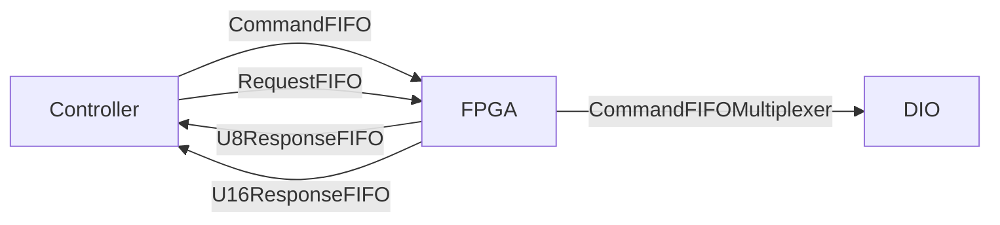

# ts_M1M3SupportFPGA

## Description

This repository contains the LabVIEW 2018 FPGA design for the M1M3 Support
System FPGA used by the **ts_M1M3Support** software. The FPGA is middleman
between [C/C++ control application](https://github.com/lsst-ts/ts_m1m3Support)
and hardware connected to cRIO.



:warning: Please use **git clone --recursive** to get linked dependencies (Common_ libraries).

## LabView Dependencies

* FPGA Support
* cRIO support
* Real Time support
* [NI Tools Network](https://www.ni.com/labview-tools-network)
  * LabView FPGA Floating-Point Library by NI

If all is installed and setup properly, LabView splash screen will show chip
and clock icons - see [an
example](https://www.evergreeninnovations.co/blog-labview-rt-project/).

:warning: Please use **git clone --recursive** to get linked dependencies (Common_ libraries).

## Build Instructions

Building the FPGA takes just about an hour. As [C++
Controller](https://github.com/lsst-ts/ts_m1m3support) is used to talk to FPGA,
you need to generate C API and transfer the bitfile to cRIO, and C header and
source files to src/LSST/M1M3/SS/FPGA directory. Bitfile is loaded by
NiFpga_Open call, and contains binary data send to program the FPGA.

1. Open LabVIEW 2018.
2. Open M1M3SupportFPGA.lvproj
3. Expand RT CompactRIO Target
4. Expand FPGA Target
5. Expand Build Specifications
6. Select M1M3SupportFPGA
7. Right-Click -> **Build**
8. Select "Use the local compile server" _(it's usually faster than LabView FPGA Compile Cloud)_
9. Click OK
10. Wait for build to successfully finish
  * check CPU usage, there should be process called Vivado taking > 20% CPU time
11. Select M1M3SupportFPGA.vi (under FPGA Target)
12. Right click, select **"Launch C API Generator"**
13. Click **Generate** (after selecting existing output directory and leaving Prefix blank)
14. Copy resulting lvbitx file to ts_m1m3Support/Bitfiles, and NiFpga_M1M3SupportFPGA.h to ts_m1m3Support/src/LSST/M1M3/SS/FPGA
15. Recompile ts_M1M3Support (make)

## Overview

The FPGA design makes heavy use of FIFOs and **S**ingle **C**ycle **T**imed
**L**oop (**SCTL**) for critical hardware loops. As FPGA has to sample DIOs
(serial lines, accelerometers,.. ), it's critical those are properly timed and
running all the time. In a classic front/back processing design (see e.g. Linux
Kernel interrupt handling), sampling code just record the values or bits and
bytes and ship them to a FIFO queues for handling. SCTLs, which are guarantee
to take one clock tick, are ideal for handling inputs and outputs.

Receiving (reading) code works by placing values into FIFO. Transmitting
(writing) code works by reading (without timeout) from FIFO, and if something
is available, act accordingly. This is coupled with DIO states (e.g. to make
sure next bit/byte on serial line is transmitted after the current).

## Command multiplexing

Commands, followed by arguments are filled into _Software
Resources/CommandFIFO_. _Commands/CommandFIFOMultiplexer_ read this and
multiplex the command to various handlers _(This is exactly how CPUs are
handling instructions from binary code)_. Handlers fills in queues (e.g. ModBus
writes queue with instructions to write if you are writing to a queue).
**SCTL**s are handling low level IO. 

### Modbus commands

Modbus commands are handled by [FPGA
Modbus](https://github.com/lsst-ts/Common_FPGA_Modbus) library. See library
description for details.

Modbus data should be write into _CommandFIFO_ after Modbus Tx address (_Data
Types/Addresses_) and length. Synchronization primitives shall be included -
_0x8000_ to wait for _ModbusTrigger_, _0x3000_ to push data into
_TimeStampFIFO_, _0x7000_ to raise IRQ. _ModbusTrigger_ (0x00fc) is a separate
command, which you can write after filling data for all Modbus connections.

To call **info** ModBus function (17, 0x11) for device at address 0x81 on
ModBus port C, write the following to **CommandFIFO**:

```
9x000B 0x0009 0x8000 0x3000 0x1302 0x1222 0x1342 0x13d8 0x20da 0x63e8 0x7000 0x00fc
```

After response is received, interrupt (if requested) is generated. Received
data are copied to Rx FIFO. Received data can be requested writing ModBus RX
address into RequestFIFO.

## Request multiplexing

ModBus replies recorded in receiving FIFOs can be obtained writing requests to
_RequestFIFO_. After writing one of the ModBus RX addresses, the value on top
of the _ResponseU16FIFO_ is number of entries to read from the FIFO. Following are:

* 4 16bit numbers - low endian U64 timestamp recorded into TimeFIFO when the
  **0x3000** command was called
* data received from ModBus port (0x9... entries). Includes CRC16 ModBus checksum
* 8 U8 low endian timestamps recorded after the last reply byte was received
* **0xA000** for frame end

Example of the communication:

* write 0x000D into request FIFO
* read length (34, 0x22) from response FIFO
* read 34 16bit words from U16 response FIFO

```
b687 22bd 0000 0000
9302 9222 9220 9224 9268 92ac 92f0 9320 9354 93fe 9376 9398 93ba 93dc 9222 92a6 92e8 92c2 92e4 933e 934e
b0c7 b028 b0c5 b022 b000 b000 b000 b000
a000
```

which makes:

* **Timestamp 1**: 0x22bd b687
* **Data**: 81 11 10 12 34 56 78 90 aa ff bb cc dd ee 11 53 74 61 72
* **Timestamp 2**: 0x22c5 28c7

## Telemetry

Telemetry data are kept in **FPGA Memory** called _Memory_ (defined under
Telemetry/Hardware). Telemetry request (253, _Data Types/Addresses_) writes 323
(telemetry size) into U16Response and dumps 323 U8 values from
_Telemetry/Hardware/Memory_ into _Software Resources/U8ResponseFIFO_. _Memory_
is filled from various FIFOs, which are filled from DIOs - see _Telemetry_ Vi.

## Health and Status

See [HealthAndStatusMemory.md](HealthAndStatusMemory.md) for memory content.
To request memory data, write command followed by parameter into
HealthAndStatusControlFIFO. Response to command is written into
HealthAndStatusDataFIFO (U64).

### Health and Status commands

| Command | Parameter | Action                                                            |
| ------- | --------- | ----------------------------------------------------------------  |
|  1      | Address   | Write address content (single U64) into HealthAndStatusDataFIFO   |
|  2      |  N/A      | Write 64 U64 into HealthAndStatusDataFIFO. This is memory content |
|  3      |  N/A      | Clear memory - write 0 to all memory cells                        |

### Health and Status Memory

See [HealthAndStatusMemory.md](HealthAndStatusMemory.md) for memory content.

## Digital Input

**DigitalInput** is very simple process that takes the digital input signals
and samples them every 0.200 ms (5kHz). The trigger for the process can be
found under *DigitalInput/Support/DigitalInputTrigger.vi* which produces a
trigger every 0.200ms and then waits for the sample process to complete. Once a
trigger is produced the *DigitalInput/Support/DigitalInputSampleLoop.vi* will
read the current timestamp and state of all digital inputs and place that
sample into a FIFO. Then at some other point in time the
*Telemetry/Support/TelemetryUpdate.vi* will call the
*DigitalInput/TryUpdateDigitalInputSample.vi* to read from **DigitalInputFIFO**
Sample, Timestamp and Value fields and writes those into three entries in
**DigitalOutputTelemetryFIFO**. **DigitalOutputTelemetryFIFO** is copied into
**TelemetryFIFO**. **TelemetryFIFO** is processed in
*Telemetry/Support/TelemetryMemoryUpdate.vi*, with values written into
*Telemetry/Hardware/Memory*. Once processed, registers *TelemetryEmptyRegister*
and *DigitalTelemetryEmpty* register are true and new sample can be obtained.


Since a SCTL only allows a FIFO writes in one loop and reads in another loop
the design utilizes multiple FIFOs to get around this restriction. In the
example above a digital input sample is pushed into the
*DigitalInputTelemetryFIFO* so that the it can be read by the
*Telemetry/CopyToTelemetryFIFO.vi* loop and pushed into the global
*TelemetryFIFO* which doesn't run inside a SCTL.

The force actuator and hardpoint actuator modbus processes are much more
complex and rely on the host machine to parse the data.

# DIO assignment

## Slot 1 - [NI 9239](https://www.ni.com/en-us/support/model.ni-9239.html)

| Port | Assignment |
| ---- | ---------- |
| AI0  |            |
| AI1  |            |
| AI2  |            |
| AI3  |            |
|Start |            |
|Stop  |            |

## Slot 2 - [NI 9239](https://www.ni.com/en-us/support/model.ni-9239.html)

| Port | Assignment |
| ---- | ---------- |
| AI0  |            |
| AI1  |            |
| AI2  |            |
| AI3  |            |
|Start |            |
|Stop  |            |

## Slot 3 - [NI 9401](https://www.ni.com/en-us/support/model.ni-9401.html)

:bus: ModBus A-D

| Port | Assignment |
| ---- | ---------- |
| DIO0 | bus A Rx   |
| DIO1 | bus B Rx   |
| DIO2 | bus C Rx   |
| DIO3 | bus D Rx   |
| DIO4 | bus A Tx   |
| DIO5 | bus B Tx   |
| DIO6 | bus C Tx   |
| DIO7 | bus D Tx   |

## Slot 4 - [NI 9401](https://www.ni.com/en-us/support/model.ni-9401.html)

:bus: ModBus E

| Port | Assignment |
| ---- | ---------- |
| DIO0 | bus E Rx   |
| DIO1 |            |
| DIO2 |            |
| DIO3 |            |
| DIO4 | bus E Tx   |
| DIO5 |            |
| DIO6 |            |
| DIO7 |            |

## Slot 5 - [NI 9375](https://www.ni.com/en-us/support/model.ni-9375.html)

## Slot 6 - [NI 9485](https://www.ni.com/en-us/support/model.ni-9485.html)

## Slot 7 - [NI 9485](https://www.ni.com/en-us/support/model.ni-9485.html)

## Slot 8 - [NI 9870](https://www.ni.com/en-us/support/model.ni-9870.html)
